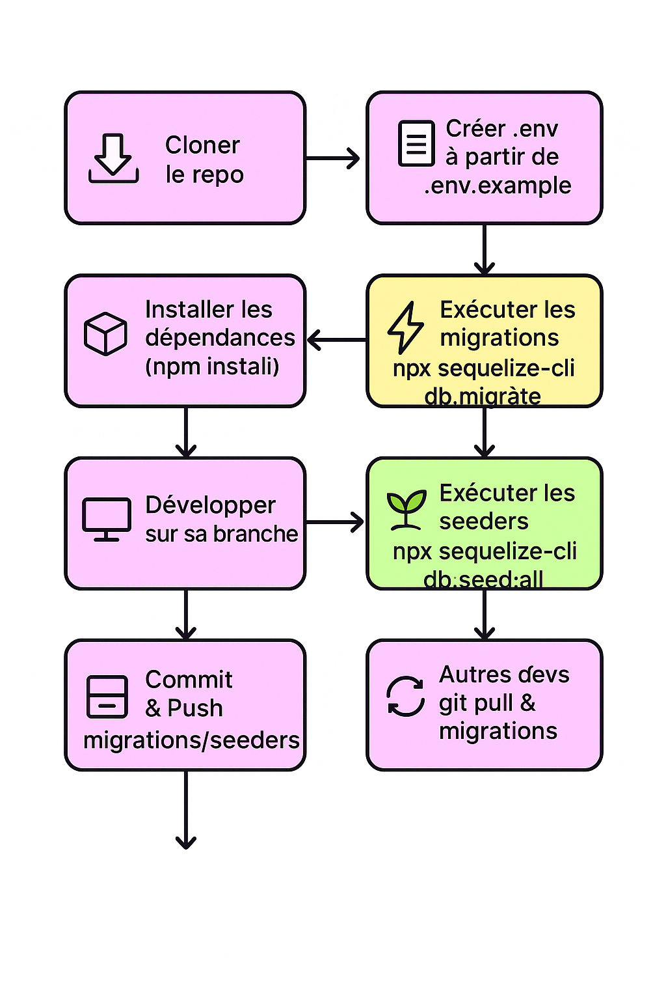

# MIGRATE.md
Introduction

Ce document explique comment un collaborateur peut intégrer la base de données du projet et travailler avec les migrations Sequelize.
L’objectif est d’assurer que tous les développeurs ont la même structure de base, sans avoir besoin d’importer des dumps SQL manuellement.

## 1. Prérequis

Node.js installé

Base de données MySQL (ou MariaDB) locale

Projet cloné depuis Git

## 2. Configuration de l’environnement

1. Copier .env.example en .env :

```bash
cp .env.example .env
```
2. Modifier les variables .env pour correspondre à la configuration locale :

```bash
DB_USERNAME=root
DB_PASSWORD=password
DB_NAME=database_development
DB_HOST=127.0.0.1
DB_DIALECT=mysql
PORT=3000
```

Chaque développeur utilise son propre .env. Le DevOps se charge de la configuration production.

## 3. Installer les dépendances

```bash
npm install
```

## 4. Initialiser la base de données locale

- Crée la base de données vide correspondant à DB_NAME.

- Lancer toutes les migrations pour créer les tables :

```bash
npx sequelize-cli db:migrate

```
- La table spéciale SequelizeMeta garde une trace des migrations déjà appliquées.

## 5. Ajouter des données initiales (facultatif)

Si tu veux pré-remplir la base avec des données de test ou des rôles par défaut :

```bash
npx sequelize-cli db:seed:all
```

- Les seeders sont versionnés et partagés via Git.

- Chaque développeur peut ainsi avoir les mêmes données initiales.

## 6. Travailler sur de nouvelles modifications

1. Ajouter une nouvelle table ou colonne → créer une migration :

```bash
npx sequelize-cli migration:generate --name add_new_table
```
2. Écrire le code SQL/Sequelize dans la migration.

3. Commit et push la migration dans Git.

4. Les autres développeurs font git pull puis :

```bash
npx sequelize-cli db:migrate
```
Leur base locale se met automatiquement à jour dans l’ordre correct.

## 7. Rollback

Si une migration pose problème, il est possible de revenir en arrière :
```bash
npx sequelize-cli db:migrate:undo

```
- Rollback une migration à la fois, dans l’ordre inverse de leur exécution.

## 8. Bonnes pratiques

Ne jamais partager un dump SQL pour le dev quotidien.

Toujours versionner migrations et seeders dans Git.

Les seeders servent uniquement à peupler la base avec des données initiales ou de test.

Chaque développeur doit exécuter les migrations sur sa base locale après un git pull.

### Résumé

Ce workflow permet de :

Avoir une structure de base cohérente pour toute l’équipe

Gérer les modifications de schéma de manière versionnée

Faciliter l’intégration d’un nouveau collaborateur sans manipulation manuelle de SQL


