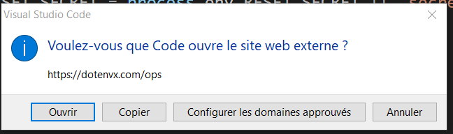
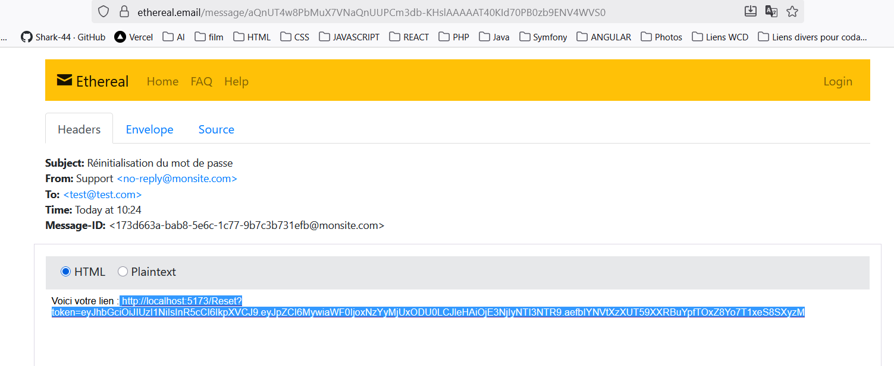

#La réinitialisation 
## Objectif
Permettre à un utilisateur qui a oublié son mot de passe de recevoir un lien par mail pour le réinitialiser.
________________________________________
## Étapes du processus
1.	L’utilisateur clique sur “Mot de passe oublié ?”
→ Il saisit son email dans un formulaire.
2.	Le frontend (React)
→ Envoie une requête POST au backend avec l’email.
3.	Le backend (Express)
→ Vérifie si l’email correspond à un utilisateur.
→ Génère un token temporaire (JWT).
→ Envoie un mail contenant un lien (par exemple :
http://localhost:5173/reset-password?token=xxxxx).
4.	L’utilisateur reçoit le mail
→ Il clique sur le lien.
→ Le frontend affiche la page “Réinitialiser le mot de passe”.
5.	Sur cette page (React)
→ Le token est lu dans l’URL.
→ L’utilisateur saisit un nouveau mot de passe.
→ Le frontend envoie ce token + le nouveau mot de passe au backend.
6.	Le backend vérifie le token
→ Si valide, met à jour le mot de passe de l’utilisateur.
→ Confirme la réinitialisation.
________________________________________
##Envoi du mail (avec Nodemailer)
Pour les tests, on utilise Ethereal, un faux serveur d’emails :
•	Il simule l’envoi (rien n’est réellement envoyé).
•	Tu peux ouvrir un lien web pour voir le mail généré.
________________________________________
## Points clés
•	Le token est temporaire et signé (JWT).
•	Le mot de passe est mis à jour seulement si le token est valide.
•	Ethereal sert uniquement pour les tests avant d’utiliser un vrai service mail.

et 

0